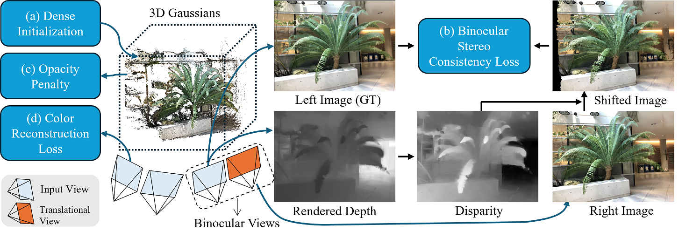

<p align="center" />
<h1 align="center">Binocular-Guided 3D Gaussian Splatting with ViewConsistency for Sparse View Synthesis </h1>

<p align="center">
    <strong>Liang Han</strong>
    ·
    <a href="https://junshengzhou.github.io/"><strong>Junsheng Zhou</strong></a>
    ·
    <a href="https://yushen-liu.github.io/"><strong>Yu-Shen Liu</strong></a>
    ·
    <a href="https://h312h.github.io/"><strong>Zhizhong Han</strong></a>
</p>
<h2 align="center">NeurIPS 2024</h2>
<h3 align="center"><a href="https://arxiv.org/abs/2410.18822">Paper</a> | <a href="https://hanl2010.github.io/Binocular3DGS/">Project Page</a></h3>
<div align="center"></div>
<p align="center">
    
</p>

We leverage dense initialization for achieving Gaussian locations, and optimize the locations and Gaussian attributes with three constraints or strategies:
<ul>
<li> Binocular Stereo Consistency Loss. We construct a binocular view pair by translating an input view with camera positions, where we constrain on the view consistency of binocular view pairs in a self-supervised manner.</li>
<li> Opacity Penalty Strategy is designed to decay the Gaussian opacity during training for regularizing them. </li>
<li> The commonly-used Color Reconstruction Loss. </li>
</ul>

## Installation
1. Clone Binocular3DGS
```
git clone --recursive https://github.com/hanl2010/Binocular3DGS.git
```
2. Setup Anaconda Environment
```
conda create -n binocular3dgs python=3.10
conda activate binocular3dgs
pip install -r requirements.txt
pip install submodules/diff-gaussian-rasterization
pip install submodules/simple-knn
```

## Dataset
- Download the processed datasets: [LLFF](https://drive.google.com/file/d/1XlnLk5SSzZ9bNdne5Wx5niA2ypo_aXAO/view?usp=drive_link) and [DTU](https://drive.google.com/file/d/13tEn6BxA3bKbTVc6xpWAbPHLALBSHOMK/view?usp=sharing)
- Download the NeRF Synthetic dataset from [here](https://drive.google.com/file/d/1RwXCLEDxm8ssWvp-qhCBWRcechk3lsQJ/view?usp=sharing)

## Checkpoints
We use the pre-trained [PDCNet+](https://github.com/PruneTruong/DenseMatching) to generate dense initialization point clouds. The pre-trained PDCNet+ model can be downloaded [here](https://drive.google.com/file/d/151X9ovbOG35tbPjioV5CYk_5GKQ8FErw/view?usp=sharing).

Put the pre-trained model in `submodules/dense_matcher/pre_trained_models`

## Training and Evaluation
#### LLFF dataset
```
python script/run_llff.py
```
#### DTU dataset
```
python script/run_dtu.py
```
#### NeRF Synthetic dataset (Blender)
```
python script/run_blender.py
```

## Citation
If you find our code or paper useful, please consider citing
```bibtex
@inproceedings{han2024binocular,
    title = {Binocular-Guided 3D Gaussian Splatting with View Consistency for Sparse View Synthesis},
    author = {Han, Liang and Zhou, Junsheng and Liu, Yu-Shen and Han, Zhizhong},
    booktitle = {Advances in Neural Information Processing Systems (NeurIPS)},
    year = {2024}
}
```

## Acknowledgement
This project is built upon [gaussian-splatting](https://github.com/graphdeco-inria/gaussian-splatting) with [simple-knn](https://gitlab.inria.fr/bkerbl/simple-knn) and a modified [diff-gaussian-rasterization](https://github.com/ashawkey/diff-gaussian-rasterization). 
The scripts for generating videos are borrowed from [DNGaussian](https://fictionarry.github.io/DNGaussian) and the scripts for dense matching are from [PDCNet+](https://prunetruong.com/pdcnet+). Thanks for these great projects.